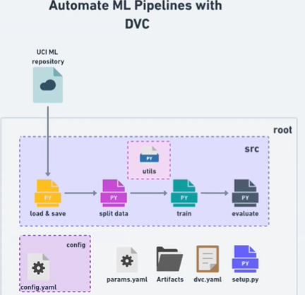
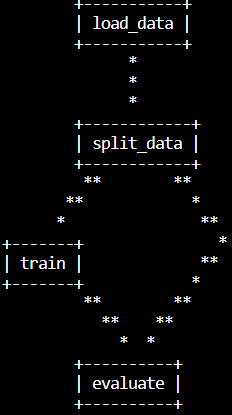

DVC_practise
==============================

DVC practise

#### To start a new DS Project Structure
##### Note : This project has already made use of cookiecutter for project setup , so directly clone and install requirements
```
pip install cookiecutter

# git url for template
cookiecutter https://github.com/drivendata/cookiecutter-data-science

cd dvc_demo_AIOPS
```

#### This project 

#### Project flow image


```
git clone https://github.com/BharadwajEdera/dvc_demo_AIOPS.git
```
```
pip install -r requirements.txt
```
#### Run below command to execute the Pipeline using dvc.yaml
```
dvc repro
```

#### TO check the Directed Acyclic Graph (DAG)
```
dvc dag
```


Project Organization
------------

    ├── LICENSE
    ├── Makefile           <- Makefile with commands like `make data` or `make train`
    ├── README.md          <- The top-level README for developers using this project.   
    ├── .dvc.yaml          <- All the Stages are mentioned in a Sequence along with each stage cmd, deps, params, outs
    ├── params.yaml        <- Parameters for the Model Training
    ├── config
    │   ├── config.yaml    <- Configuration Settings for artifacts, data, Model and Reports 
    ├── data
    │   ├── external       <- Data from third party sources.
    │   ├── interim        <- Intermediate data that has been transformed.
    │   ├── processed      <- The final, canonical data sets for modeling.
    │   └── raw            <- The original, immutable data dump.
    │
    ├── docs               <- A default Sphinx project; see sphinx-doc.org for details
    │
    ├── models             <- Trained and serialized models, model predictions, or model summaries
    │
    ├── notebooks          <- Jupyter notebooks. Naming convention is a number (for ordering),
    │                         the creator's initials, and a short `-` delimited description, e.g.
    │                         `1.0-jqp-initial-data-exploration`.
    │
    ├── references         <- Data dictionaries, manuals, and all other explanatory materials.
    │
    ├── reports            <- Generated analysis as HTML, PDF, LaTeX, etc.
    │   └── figures        <- Generated graphics and figures to be used in reporting
    │
    ├── requirements.txt   <- The requirements file for reproducing the analysis environment, e.g.
    │                         generated with `pip freeze > requirements.txt`
    │
    ├── setup.py           <- makes project pip installable (pip install -e .) so src can be imported
    ├── src                <- Source code for use in this project.
    │   ├── __init__.py    <- Makes src a Python module
    │   │
    │   ├── stage_01_load_save.py    <- To Load Data and save it in local folders
    │   │
    │   ├── stage_02_split_data.py    <- To Split Data into train , test and save it in local folders
    │   │
    │   ├── stage_03_train.py         <- ToTrain the Model
    │   │
    │   ├── stage_04_evaluate.py    <- To Evaluate the Model Performance
    │   │
    │   ├── utils           <- All the required functions like read_config , create directories etc
    │   │   └── all_utils.py
    │   ├── data           <- Scripts to download or generate data
    │   │   └── make_dataset.py
    │   │
    │   ├── features       <- Scripts to turn raw data into features for modeling
    │   │   └── build_features.py
    │   │
    │   ├── models         <- Scripts to train models and then use trained models to make
    │   │   │                 predictions
    │   │   ├── predict_model.py
    │   │   └── train_model.py
    │   │
    │   └── visualization  <- Scripts to create exploratory and results oriented visualizations
    │       └── visualize.py
    │
    └── tox.ini            <- tox file with settings for running tox; see tox.readthedocs.io


--------

